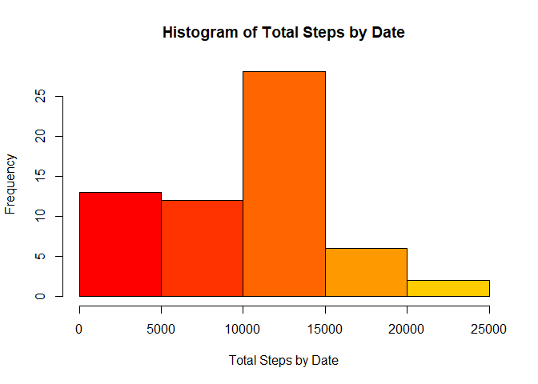
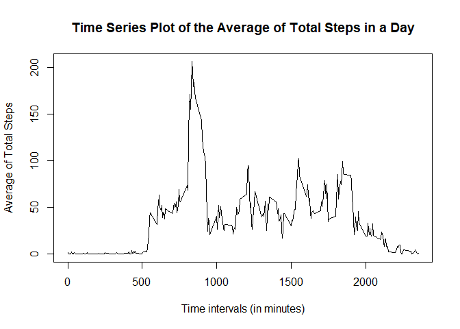
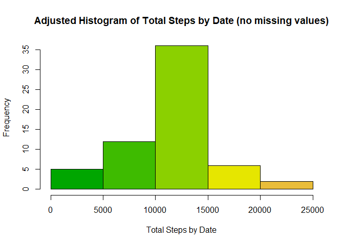
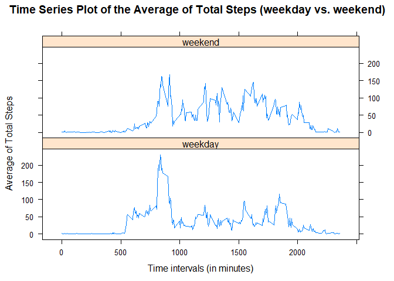

## Loading and preprocessing the data

```r
activity <- read.csv(unz("C:/Users/anjshrivastava/Documents/Data_Science_Homework/datasciencecoursera/RepData_PeerAssessment1/activity.zip", "activity.csv"),colClasses=c("numeric","Date","numeric"))
str(activity)
```

```
## 'data.frame':	17568 obs. of  3 variables:
##  $ steps   : num  NA NA NA NA NA NA NA NA NA NA ...
##  $ date    : Date, format: "2012-10-01" "2012-10-01" ...
##  $ interval: num  0 5 10 15 20 25 30 35 40 45 ...
```

## What is mean total number of steps taken per day?


```r
sum_by_date <- tapply(activity$steps,activity$date,sum,na.rm=TRUE)
hist(sum_by_date,col=heat.colors(8),xlab="Total Steps by Date",main="Histogram of Total Steps by Date")
```

<!-- -->

```r
mean(sum_by_date)
```

```
## [1] 9354.23
```

```r
median(sum_by_date)
```

```
## [1] 10395
```

## What is the average daily activity pattern?


```r
mean_by_int <- tapply(activity$steps,activity$interval,mean,na.rm=TRUE)
plot(row.names(mean_by_int),mean_by_int,type="l",xlab="Time intervals (in minutes)",ylab="Average of Total Steps",main="Time Series Plot of the Average of Total Steps in a Day")
```

<!-- -->

```r
x <- max(mean_by_int)
match(x,mean_by_int)
```

```
## [1] 104
```

```r
mean_by_int[104]
```

```
##      835 
## 206.1698
```

## Imputing missing values


```r
sum(is.na(activity))
```

```
## [1] 2304
```

```r
act_na <- activity[is.na(activity),]
act_no_na <- activity[complete.cases(activity),]
act_na$steps <- as.numeric(mean_by_int)
new_act <- rbind(act_na,act_no_na)
new_act <- new_act[order(new_act[,2],new_act[,3]),]
new_sum_by_date <- tapply(new_act$steps,new_act$date,sum)
hist(new_sum_by_date,col=terrain.colors(8),xlab="Total Steps by Date",main="Adjusted Histogram of Total Steps by Date (no missing values)")
```

<!-- -->

```r
mean(new_sum_by_date)
```

```
## [1] 10766.19
```

```r
median(new_sum_by_date)
```

```
## [1] 10766.19
```

## Are there differences in activity patterns between weekdays and weekends?

```r
days <- weekdays(new_act[,2])
new_act <- cbind(new_act,days)
library(plyr)
```

```
## Warning: package 'plyr' was built under R version 3.5.1
```

```r
new_act$days <- revalue(new_act$days,c("Monday"="weekday","Tuesday"="weekday","Wednesday"="weekday","Thursday"="weekday","Friday"="weekday"))
new_act$days <- revalue(new_act$days,c("Saturday"="weekend","Sunday"="weekend"))
new_mean_by_int <- tapply(new_act$steps,list(new_act$interval,new_act$days),mean)
library(reshape2)
```

```
## Warning: package 'reshape2' was built under R version 3.5.1
```

```r
new_mean_by_int <- melt(new_mean_by_int)
colnames(new_mean_by_int) <- c("interval","day","steps")
library(lattice)
xyplot(new_mean_by_int$steps ~ new_mean_by_int$interval | new_mean_by_int$day, layout=c(1,2),type="l",main="Time Series Plot of the Average of Total Steps (weekday vs. weekend)",xlab="Time intervals (in minutes)",ylab="Average of Total Steps")
```

<!-- -->


